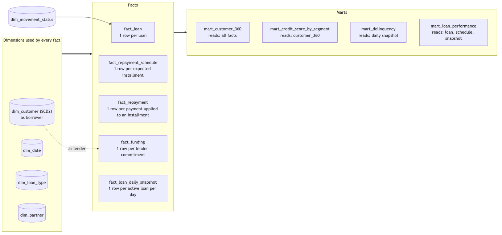

# Fazz Data Engineer Case Study - Task 1: Lending Data Warehouse

Dimensional warehouse + data marts for a P2P lending business, delivered as a runnable **dbt**
project. Models are written for **BigQuery**; they run locally on **DuckDB** against synthetic
data, so the whole thing builds without credentials.

```bash
uv sync                                   # creates .venv from pyproject.toml / uv.lock
uv run dbt deps                           # installs dbt_utils
DBT_PROFILES_DIR=. uv run dbt build       # seeds -> staging -> dims -> facts -> marts -> tests
```

**5 facts - 5 conformed dimensions (customer = SCD Type 2) - 4 marts. All tests pass except two
intentional `warn`s that surface planted source defects.**
Full design rationale: [`docs/design_details.md`](docs/design_details.md). Lineage and column docs:
`uv run dbt docs generate && uv run dbt docs serve`.

---

## 1. Source analysis

Ten table specs and an ERD were provided; **no data rows**. The specs are treated as the source
contract and exercised with synthetic data (`seeds/generate_seeds.py`).

Issues found in the specs, each handled explicitly in staging:

| Issue | Handling |
|---|---|
| `loan.movement_status_id` is INTEGER, `movement_status.movement_id` is STRING | cast in `stg_loan`; relationship test |
| `individual`, `company`, `insurance` use naive DATETIME, others TIMESTAMP | -> UTC with a fixed UTC+7 offset (Jakarta, no DST; `source_utc_offset_hours` var) |
| `loan.movement_status_id` duplicates `loan_movement` history and can disagree | history is truth; disagreement surfaced by `fact_loan.has_status_mismatch` (warn) |
| `company.founded` is STRING in mixed formats | parsed to DATE, NULL if unparseable |
| `fund.fund_ratio` should sum to 1 per loan; nothing enforces it | singular test (warn) |
| `is_borrower` / `is_lender` both true; `individual` ~ `company` | one `dim_customer` with `entity_type` and `customer_role` |
| orphaned FKs possible | `UNKNOWN` member in every dimension; facts never carry NULL keys |

**Gaps the task requires us to fill.** "Repayments" and a credit score are required but have no
source table. Three minimal entities are *proposed* (kept separate in `seeds/proposed/`):
`repayment_schedule` (expected installments; lump sum = 1 row), `repayment` (raw transfers, not
pre-allocated), `credit_assessment` (point-in-time score).

**Key assumptions.** `loanhub_loan` = partner channeling mapping, 0..1 per loan -> every loan has
`origination_channel` direct/partner. Payments are allocated oldest-due-first. `lender_type` is
derived from `entity_type` (company -> institutional) pending a real master-data attribute.
Segmentation uses only source-present attributes - no invented thresholds; the only numeric
cut-offs are the OJK DPD buckets (current / 1-30 / 31-60 / 61-90 / >90) and the TKB90 line.

---

## 2. Model



Conceptual ERD: [`docs/diagrams/01_conceptual_erd.png`](docs/diagrams/01_conceptual_erd.png)
(one customer -> many loans / fundings; one loan -> many movements, fundings, installments, repayments).

| Fact | One row = | Type |
|---|---|---|
| `fact_loan` | one loan; milestones (`requested_at ... disbursed_at, closed_at`), channel, funding/insurance roll-ups, repayment totals, `outstanding_principal` | accumulating snapshot |
| `fact_repayment_schedule` | one expected installment | transactional, immutable |
| `fact_repayment` | one payment **applied to one installment** (`transfer_id` preserved) | transactional, append-only |
| `fact_funding` | one lender commitment to one loan (`fund_record` rolled up; `current_exposure_amount`) | transactional |
| `fact_loan_daily_snapshot` | one **active** loan per day through its closing day: outstanding, overdue, DPD, bucket, `is_npl_90` | periodic snapshot |

**`dim_customer` (SCD2).** `individual` union `company`; one row per version, opened whenever the
source record or the credit score changes; `customer_key = customer_id#sequence_no` (deterministic
surrogate - rebuild-safe, readable, no sequences needed on BigQuery). Facts store the version valid
when the loan was requested / the funding was made. Geography is denormalized into the dimension
(star, not snowflake). In production, with current-state-only sources, the same policy is a
`dbt snapshot` with `check_cols`.

Small dims (natural keys, no SCD): `dim_date`, `dim_loan_type`, `dim_movement_status`
(lifecycle order, terminal flags), `dim_partner` (+ `DIRECT` member).

Physical design on BigQuery: facts partitioned by their event date and clustered by loan /
customer via a target-aware `bq_partition` macro.

---

## 3. Data marts (built only from dims + facts)

| Mart | Grain | Answers |
|---|---|---|
| `mart_customer_360` | current customer | borrower metrics (volumes, outstanding, `max_dpd_ever`, on-time rate) + lender metrics (commitments, exposure); base for the two below and for lender concentration |
| `mart_credit_score_by_segment` | segment_type x segment_value | **avg credit score per segment** (entity type, role, channel, lender type, province, grade, repeat, entityxchannel) with realised-risk context |
| `mart_delinquency` | day x loan type x partner x grade | **delinquency rates**: outstanding by DPD bucket, delinquency rate, PAR30, NPL90, **TKB90** |
| `mart_loan_performance` | disbursement cohort x type x partner x grade x mode | **loan performance**: volumes, outcomes, collections, write-off rates, 30DPD-within-90d vintage |

Sample (synthetic, as of 2026-08-21):

| channel | loans_active | outstanding (IDR M) | delinquency_rate | par30 | tkb90 |
|---|---|---|---|---|---|
| direct | 45 | 314.9 | 0.323 | 0.161 | 0.908 |
| partner | 24 | 115.9 | 0.405 | 0.282 | 0.943 |

---

## 4. Pipeline & quality

```
seeds (sources) -> staging views -> intermediate (ephemeral) -> warehouse (dims, facts) -> marts
                   cast - tz - dedupe    customer change stream -
                   FK type fix           loan milestones - payment allocation
```

Tests run with `dbt build`: key uniqueness/not-null, relationships, accepted values (generic and
`dbt_utils`), plus singular checks - allocation is lossless, snapshot reconciles to `fact_loan`,
no join fan-out, SCD2 intervals contiguous with one current row, `fund_ratio` sums to 1 (warn),
status consistency (warn), schedule principal = loan amount, lifecycle timestamps ordered.

Production: seeds become `sources:`; the customer SCD2 runs as a `dbt snapshot`; the daily snapshot
and large facts go incremental on their date partition with delete+insert over a trailing window.

---

## 5. Decisions & limits (short)

- **Allocate payments at load time**, once, rather than in every query -> consistent DPD everywhere.
- **Two repayment facts** (schedule + payments) so partial and multi-installment payments keep their detail.
- **Snapshot active loans only** - size tracks the live book; doubles as OJK daily-position base.
- **No `fact_loan_movement`**; funnel = milestone columns on `fact_loan`. Named extension.
- Out of scope: lender yield (no interest ledger), rejection reasons, collections workflow,
  insurance claims, PII controls (would be BigQuery policy tags).

## Layout

```
pyproject.toml - uv.lock              dependencies (dbt-core, dbt-duckdb; optional dbt-bigquery)
packages.yml                          dbt_utils
dbt_project.yml - profiles.yml        3 vars (utc offset, as_of_date, tolerance) - duckdb/bigquery targets
seeds/{given,proposed,reference}/     sources; generate_seeds.py
macros/                               bq_partition only (BigQuery partition config, none on DuckDB)
models/{staging,intermediate,warehouse,marts}/
tests/                                singular DQ tests
docs/{diagrams,design_details.md}
```
