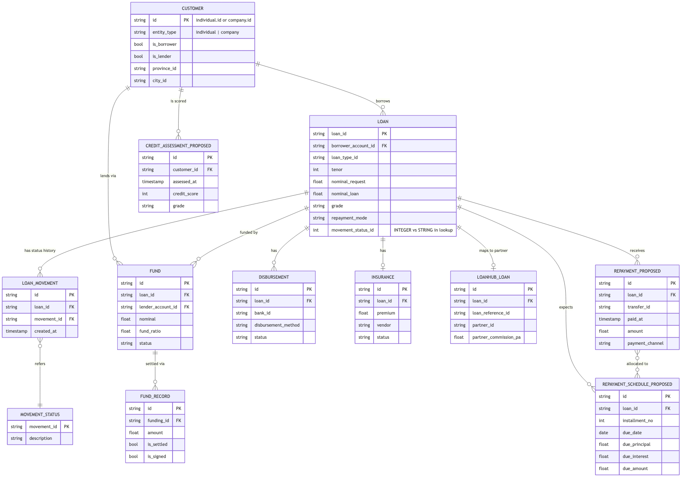

# Fazz Data Engineer Case Study - Task 1: Lending Data Warehouse

[](https://github.com/dailyimah/lending-dwh-dbt/actions/workflows/pages.yml)
**Live site:** https://dailyimah.github.io/lending-dwh-dbt/ (overview, design details, dbt docs with lineage).

A dbt project for a P2P lending warehouse: BigQuery-style SQL, run locally on DuckDB against
synthetic seeds, so it builds with no credentials. 5 facts, 5 conformed dimensions (customer is
SCD Type 2), 4 marts. All transformations are dbt models under `models/` - `staging` (cleaning),
`intermediate` (allocation, milestones), `warehouse` (dims and facts), `marts` - with tests in
their `.yml` files and `tests/`. `dbt build` is green; the only two warnings are planted source defects.

```bash
uv sync && uv run dbt deps
DBT_PROFILES_DIR=. uv run dbt build      # seeds -> staging -> dims -> facts -> marts -> tests
```

Lineage and column docs: `uv run dbt docs generate && uv run dbt docs serve`.
Design notes (spec findings, assumptions, trade-offs): [docs/design_details.md](docs/design_details.md).

## Model

The business entities: customers (individuals and companies, who can borrow, lend, or both),
loans, the loan's status history, disbursement, insurance, partner mapping, lender fundings with
their settlement records, and - proposed, since the specs omit them - repayment schedules,
repayments and credit assessments. One customer has many loans and many fundings; one loan has
many status movements, fundings, scheduled installments and repayments.



The dimensional model: five facts around conformed dimensions, each dimension shared by every
fact that needs it so new marts can be added without remodeling.


| Fact | One row = | Primary key |
|---|---|---|
| `fact_loan` | one loan, application to closure; milestone timestamps, channel, funding roll-up, outstanding principal | `loan_id` |
| `fact_repayment_schedule` | one expected installment (lump sum = 1 row) | `(loan_id, installment_no)` |
| `fact_repayment` | one payment applied to one installment; `transfer_id` preserved | `repayment_allocation_key` |
| `fact_funding` | one lender commitment to one loan; `fund_record` rolled up | `fund_id` |
| `fact_loan_daily_snapshot` | one active loan per day, disbursement to closing day: outstanding, DPD, bucket | `(snapshot_date, loan_id)` |

`dim_customer` unifies `individual` and `company` (a customer can be borrower, lender or both) as
SCD Type 2: a version opens when the record or the credit score changes; key
`customer_key = customer_id#sequence_no`; facts store the version valid at event time. Other
dims (`dim_date`, `dim_loan_type`, `dim_movement_status`, `dim_partner`) are plain lookups.

## Marts

| Mart | Grain | Task ask |
|---|---|---|
| `mart_credit_score_by_segment` | segment type x value (entity type, role, channel, province) | average credit score per customer segment |
| `mart_delinquency` | day x loan type x partner x grade | delinquency rates: DPD buckets, PAR30, NPL90, TKB90 |
| `mart_loan_performance` | disbursement cohort x type x partner x grade x mode | loan performance: volumes, outcomes, collections, write-offs, vintage |
| `mart_customer_360` | current customer | per-customer borrower and lender metrics; feeds the segment mart |

## Source gaps and assumptions

- The specs have no repayment table and no credit score, so three minimal source entities are
  proposed and kept apart in [`seeds/proposed/`](seeds/proposed): `repayment_schedule`,
  `repayment`, `credit_assessment`.
- Status values are not given; the lifecycle vocabulary lives in one mapping seed,
  [`ref_movement_status_map.csv`](seeds/reference/ref_movement_status_map.csv).
- Naive DATETIME columns are treated as Jakarta time (UTC+7).
- Payments are allocated to installments oldest-due-first, once, at load time.
- Orphaned foreign keys resolve to an `UNKNOWN` member in every dimension.

## Quality

Singular tests beyond the usual key and relationship checks: allocation is lossless (allocated =
transferred per loan); the daily snapshot reconciles to `fact_loan`; joining `fact_loan` to its
dimensions causes no fan-out; SCD2 intervals are contiguous with one current version; `fund_ratio`
sums to 1 and `loan` status agrees with movement history (both warn - the two planted defects).

## Decisions

- Allocation happens at load time so DPD is identical in every report; the alternative was
  re-deriving it in every query.
- Two repayment facts (schedule and payments) keep partial and multi-installment payments intact.
- The snapshot covers active loans only, so its size tracks the live book, not history.
- No `fact_loan_movement`: the funnel is milestone columns on `fact_loan`; a transition-grain fact
  is the extension.
- Metrics live in marts, never in the SCD2 dimension.
