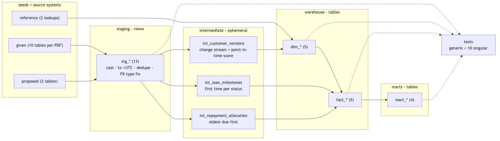

# Design details

Companion to the overview: what was inferred from the specs, what was assumed, how the model is
shaped, and which trade-offs were made. Repo: https://github.com/dailyimah/lending-dwh-dbt

1. [Source analysis and assumptions](#1-source-analysis-and-assumptions)
2. [Dimensional model](#2-dimensional-model)
3. [Data marts](#3-data-marts)
4. [Pipeline and data quality](#4-pipeline-and-data-quality)
5. [Decisions and trade-offs](#5-decisions-and-trade-offs)
6. [Scope limits and extensions](#6-scope-limits-and-extensions)

---

## 1. Source analysis and assumptions

**Provided:** ten table specs (column / type / description) and an ERD. **No data rows, no
enumerated values.** The specs are treated as the source contract and exercised with synthetic
data from [`seeds/generate_seeds.py`](https://github.com/dailyimah/lending-dwh-dbt/blob/main/seeds/generate_seeds.py),
which plants the defects listed below so the pipeline has something to prove.

The business is a two-sided P2P lending marketplace: individuals and companies can be borrowers
and/or lenders; several lenders fund one loan fractionally; loans move through statuses over time;
some loans come through channeling partners.

### What the specs say, and how it is treated

| Spec | Treatment |
|---|---|
| `loan.movement_status_id` is INTEGER, `movement_status.movement_id` is STRING | cast in `stg_loan`; relationship test |
| `individual`, `company`, `insurance` use DATETIME (no zone); other tables TIMESTAMP | -> UTC with a fixed UTC+7 offset (assumed Jakarta; `source_utc_offset_hours` var) |
| `loan.movement_status_id` and `loan_movement` both describe status | history is the source of truth; disagreement surfaced by `fact_loan.has_status_mismatch` (warn) |
| `company.founded` is a free STRING | `YYYY`, `YYYY-MM-DD`, `MM/YYYY` parsed; other shapes -> NULL |
| `fund.fund_ratio` = "ratio of funds contributed by the lender" | read as the lender's share of the loan, expected to sum to 1 (warn test) |
| `is_borrower` / `is_lender` on both `individual` and `company` | one `dim_customer` with `entity_type` and `customer_role` |
| foreign keys may be orphaned | `UNKNOWN` member in every dimension; facts never carry NULL keys |

### Gaps the task requires us to fill

"Repayments" is a required core entity and a credit-score mart is required, but no source table
provides either. Three minimal entities are proposed and kept apart in
[`seeds/proposed/`](https://github.com/dailyimah/lending-dwh-dbt/tree/main/seeds/proposed):

| Proposed table | Columns | Why |
|---|---|---|
| `repayment_schedule` | id, loan_id, installment_no, due_date, due_principal, due_interest, due_amount | expected side of delinquency; lump sum = 1 row |
| `repayment` | id, loan_id, transfer_id, paid_at, amount, payment_channel | actual transfers, not pre-allocated |
| `credit_assessment` | id, customer_id, assessed_at, credit_score, grade | point-in-time score |

### Assumptions (not stated in the task)

- **Status vocabulary.** The spec lists no status values. The eight lifecycle stages, their order
  and terminal/active flags live in one mapping seed,
  [`ref_movement_status_map.csv`](https://github.com/dailyimah/lending-dwh-dbt/blob/main/seeds/reference/ref_movement_status_map.csv);
  unmapped descriptions surface as `unmapped` plus a warn test. Replacing the seed needs no SQL change.
- A loan is on book from its first `disbursed` movement until a terminal movement.
- `loan.created_at` is the application time; `tenor` is in months as specified.
- `disbursement.status`, `fund.status`, `insurance.status`, `fund_record.is_signed` are carried but
  not interpreted (values unknown).
- `loanhub_loan` is a 0..1 partner-channeling mapping; no mapping = `DIRECT`; a customer's
  acquisition channel is the channel of their first loan.
- `lender_type`: company -> institutional, individual -> retail (pending a master-data attribute).
- Payments are allocated oldest-due-first with a proportional principal/interest split.
- Reference seeds (`ref_loan_type`, `ref_partner`) are placeholder lookups.
- Amounts are IDR. `as_of_date` (2026-08-21) is the synthetic horizon, the run date in production.
  `dim_date` spans 2024-01-01..2028-01-01.
- DPD buckets (1-30 / 31-60 / 61-90 / >90) are standard ageing; the 90-day line is the OJK TKB90
  metric. OJK and partner-channel remarks are business context, not properties of the data.
- Staging keeps the latest `updated_at` row per key and drops identical re-touches of customer rows.

---

## 2. Dimensional model

Conceptual entities and relationships (proposed entities suffixed `_PROPOSED`):

### Bus matrix

| Business process -> fact | Type | dim_customer | dim_date | dim_loan_type | dim_movement_status | dim_partner |
|---|---|:-:|:-:|:-:|:-:|:-:|
| Loan origination and lifecycle -> `fact_loan` | accumulating snapshot | borrower | x | x | x | x |
| Repayment scheduling -> `fact_repayment_schedule` | transactional (immutable) | borrower | due date | x | | x |
| Repayment collection -> `fact_repayment` | transactional (append-only) | borrower | paid date | x | | x |
| Lender funding -> `fact_funding` | transactional | **lender** | x | x | | x |
| Daily portfolio position -> `fact_loan_daily_snapshot` | periodic snapshot | borrower | x | x | x | x |

`dim_customer` appears in every row and plays two roles (borrower, lender) - the reason
`individual` and `company` are conformed into one dimension.

### Grain

| Fact | One row = | Primary key |
|---|---|---|
| `fact_loan` | one loan, application -> closure; row updated as milestones occur | `loan_id` |
| `fact_repayment_schedule` | one expected installment (lump sum = 1 row) | `(loan_id, installment_no)` |
| `fact_repayment` | one payment applied to one installment; `transfer_id` preserved | `repayment_allocation_key` |
| `fact_funding` | one lender commitment to one loan; `fund_record` rolled up | `fund_id` |
| `fact_loan_daily_snapshot` | one active loan on one day, disbursement -> closing day | `(snapshot_date, loan_id)` |

### `dim_customer` (SCD Type 2)

One row per customer version. Key `customer_key = customer_id#sequence_no` - a deterministic
surrogate: rebuild-stable, human-readable, no sequences needed on BigQuery. A version opens
whenever the source record or the credit score changes. Facts store the version valid at event
time (loan request, funding), which is what point-in-time regulatory reporting needs. Geography
is denormalized into the dimension (star, not snowflake). In production with current-state-only
sources the same policy is a `dbt snapshot` with `check_cols`.

| customer_key | city_id | credit_score | valid_from | valid_to | is_current |
|---|---|---|---|---|---|
| `C-101#1` | C3374 | *null* | 2024-11-21 | 2025-09-14 | false |
| `C-101#2` | C3374 | 584 | 2025-09-14 | 2026-03-14 | false |
| `C-101#3` | C3374 | 602 | 2026-03-14 | 9999-12-31 | true |

Small dimensions (natural keys, no SCD): `dim_date`, `dim_loan_type`, `dim_movement_status`
(mapped vocabulary, lifecycle order, flags), `dim_partner` (+ `DIRECT`). Every dimension has an
`UNKNOWN` member.

### Physical design (BigQuery)

Facts are partitioned by their event date (`disbursed_date`, `due_date`, `paid_date`,
`funded_date`, `snapshot_date`) and clustered by loan / customer, declared through
[`bq_partition`](https://github.com/dailyimah/lending-dwh-dbt/blob/main/macros/bq_partition.sql)
so the same models also run on DuckDB. Not yet executed on BigQuery.

---

## 3. Data marts

| Mart | Grain | Answers |
|---|---|---|
| `mart_customer_360` | current customer | borrower metrics (volumes, outstanding, max DPD, on-time rate) and lender metrics (commitments, exposure); base for the segment mart and lender concentration |
| `mart_credit_score_by_segment` | segment_type x segment_value | **average credit score per segment** (entity type, role, channel, province) with realised-risk context |
| `mart_delinquency` | day x loan type x partner x grade | **delinquency rates**: outstanding by DPD bucket, delinquency rate, PAR30, NPL90, TKB90 |
| `mart_loan_performance` | disbursement cohort x type x partner x grade x mode | **loan performance**: volumes, outcomes, collections, write-off rates, 30DPD-within-90d vintage |

Synthetic result as of 2026-08-21: 69 active loans, TKB90 0.917, PAR30 0.193; direct channel
TKB90 0.908 vs partner 0.943.

---

## 4. Pipeline and data quality

| Layer | Materialization | Responsibility |
|---|---|---|
| staging | view | one model per source table: casts, UTC, dedupe, FK type fix |
| intermediate | ephemeral | customer change stream, loan milestones, payment allocation |
| warehouse | table | 5 dims, 5 facts; `customer_key` resolved as of event time |
| marts | table | thin aggregations over dims and facts |

Tests run in `dbt build`. Generic: unique / not-null keys, relationships, accepted values
(`dbt_utils` for composite keys and ranges). Singular checks worth knowing:

| Check | Catches |
|---|---|
| allocation is lossless (per loan, allocated = transferred) | money created or lost in allocation |
| snapshot reconciles to `fact_loan` on the as-of date | the two facts drifting apart |
| no fan-out joining `fact_loan` to its dimensions | a dimension join multiplying rows |
| SCD2 intervals contiguous, one current row per customer | broken versioning |
| `fund_ratio` sums to 1; status history matches `loan` (both warn) | source defects, surfaced without halting the load |

Two warnings are expected on the synthetic data: the planted 0.95 `fund_ratio` and the planted
status mismatch.

Production notes: seeds become `sources:`; the customer SCD2 runs as a `dbt snapshot`; the daily
snapshot and large facts become incremental on their date partition with delete+insert over a
trailing window.

---

## 5. Decisions and trade-offs

- **Deterministic surrogate key** (`customer_id#sequence_no`) instead of an opaque integer: same
  input, same key, so a full refresh never breaks fact FKs; readable during audit.
- **Payments allocated at load time.** Running total of payments vs running total of dues; the
  overlap of the two intervals is the allocation. Done once, so DPD is identical in every report.
  Alternative rejected: raw transfers with allocation in every query.
- **Two repayment facts.** A single "installment with paid columns" table cannot represent partial
  or multi-installment payments and its rows mutate.
- **Snapshot covers active loans only.** Size tracks the live book; closing day carries the
  terminal status; the final state of every loan lives in `fact_loan`.
- **No `fact_loan_movement`.** Status history is compressed into milestone timestamps on the
  accumulating `fact_loan`; the transaction-grain fact is the named extension.
- **Metrics live in marts, not in the SCD2 dimension** - otherwise every repayment would open a
  customer version.
- **No invented thresholds.** Segmentation uses source attributes only; the only numeric cut-offs
  are the regulatory DPD buckets.

---

## 6. Scope limits and extensions

Out of scope: lender returns / yield (no interest data), application rejection reasons,
collections workflow, insurance analytics beyond a flag, intraday positions, PII controls (in
production: BigQuery policy tags).

Named extensions: `fact_fund_settlement` (settlement timeline), `fact_loan_movement`,
`fact_credit_assessment`, a partner-performance mart on `dim_partner`.
