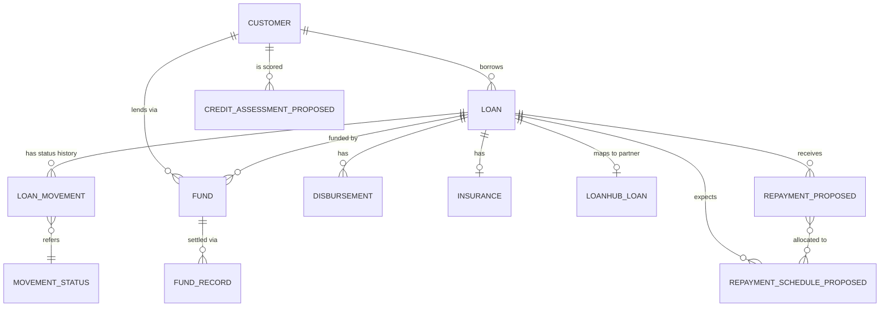
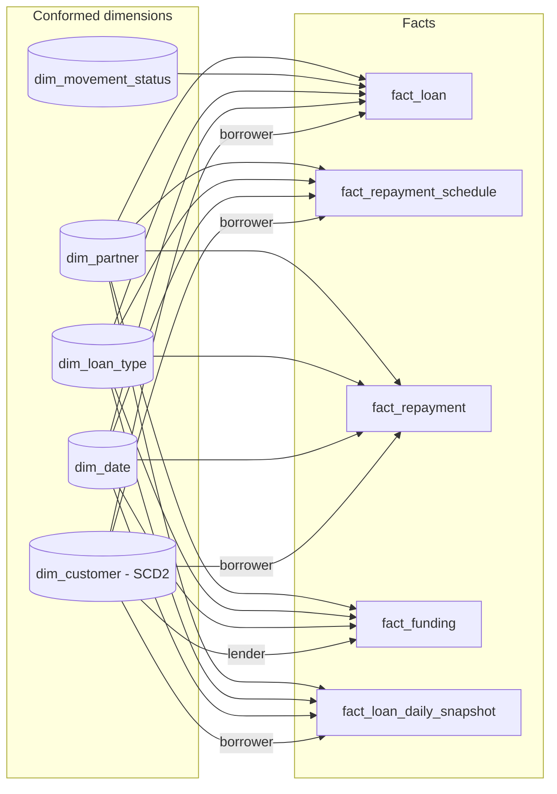
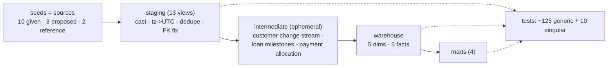

# Fazz Data Engineer Case Study - Task 1: Lending Data Warehouse

A dimensional data warehouse and data marts for a P2P lending business, delivered as a
runnable **dbt** project (BigQuery-targeted models, executed locally on DuckDB with
synthetic data).

| | |
|---|---|
| Stack | dbt-core 1.12 - models written for **BigQuery** - run locally on **DuckDB** (no credentials needed) |
| Model | 5 facts - 5 conformed dimensions (customer = SCD Type 2) - 4 marts - 3 intermediate |
| Quality | 151 dbt nodes: 149 pass, 2 intentional `warn`s that surface planted source defects |
| Run it | `python3 -m venv .venv && . .venv/bin/activate && pip install dbt-core dbt-duckdb && DBT_PROFILES_DIR=. dbt build` |

---

## Contents

1. [Source analysis & assumptions](#1-source-analysis--assumptions)
2. [Conceptual model (entities & relationships)](#2-conceptual-model)
3. [Dimensional model](#3-dimensional-model)
4. [Data marts](#4-data-marts)
5. [Transformation pipeline](#5-transformation-pipeline)
6. [Data quality & validity checks](#6-data-quality--validity-checks)
7. [Design decisions & trade-offs](#7-design-decisions--trade-offs)
8. [Scope limits & extensions](#8-scope-limits--extensions)
9. [Appendix - questions the model answers](#9-appendix--questions-the-model-answers)

---

## 1. Source analysis & assumptions

### 1.1 What was provided

Ten table specifications (column / type / description) and one ERD: `loan`, `loan_movement`,
`movement_status`, `disbursement`, `loanhub_loan`, `fund`, `fund_record`, `insurance`,
`individual`, `company`. **No data rows were provided for Task 1**, so the specifications are
treated as the source contract and the SQL is design-verified against synthetic data generated
to those specifications (`seeds/generate_seeds.py`, fixed random seed).

The business is a two-sided P2P lending marketplace: individuals and companies can be borrowers
*and/or* lenders; several lenders fund one loan fractionally (`fund.fund_ratio`); loans move
through statuses over time (`loan_movement`); some loans originate through channeling partners
(`loanhub_loan`). Indonesian P2P lending is OJK-regulated, which shapes the reporting requirements
(point-in-time truth, DPD buckets, TKB90).

### 1.2 Observations on the source specifications

These inconsistencies exist in the provided specs themselves. Each is handled explicitly in the
staging layer rather than silently.

| # | Observation | Handling |
|---|---|---|
| 1 | `loan.movement_status_id` is **INTEGER**, but `movement_status.movement_id` is **STRING** - the FK cannot join as specified | Cast to STRING in `stg_loan`; relationship test enforces the join |
| 2 | Most tables use **TIMESTAMP**; `individual`, `company`, `insurance` use **DATETIME** (no timezone) | Converted to UTC assuming `Asia/Jakarta` (`reporting_timezone` var) - documented assumption, one macro (`local_to_utc`) |
| 3 | `loan.movement_status_id` duplicates what `loan_movement` history already says; the two can disagree | History is the source of truth; current status is derived from the latest movement; disagreement is surfaced by `fact_loan.has_status_mismatch` and a `warn` test |
| 4 | `company.founded` is **STRING** | Parsed from three observed formats (`YYYY`, `YYYY-MM-DD`, `MM/YYYY`) to DATE; NULL if unparseable |
| 5 | `fund.fund_ratio` should sum to 1.0 per loan; nothing enforces it | Singular test `assert_fund_ratio_sums_to_one` (warn) |
| 6 | `is_borrower` / `is_lender` can both be true | Unified customer dimension with `customer_role in {borrower, lender, both, none}` |
| 7 | `individual` and `company` are near-identical tables | Conformed into one `dim_customer` with `entity_type`; company-only columns nullable |
| 8 | `tenor` is documented in *months*, while the real products include ~14-day working-capital loans | Spec kept (months); flagged as an assumption to confirm with the source team |
| 9 | Orphaned foreign keys are possible (e.g. a `borrower_account_id` with no customer record) | Facts never carry NULL keys: an `UNKNOWN` member row exists in every dimension |

### 1.3 Gaps the task requires us to fill - proposed source entities

The task lists **Repayments** as a core entity and requires a **credit score** mart, but no
source table provides either. The following minimal source shapes are *proposed* (and clearly
separated from the given tables in `seeds/proposed/`):

| Proposed table | Columns | Why |
|---|---|---|
| `repayment_schedule` | `id, loan_id, installment_no, due_date, due_principal, due_interest, due_amount` | Expected installments; a lump-sum loan is a 1-row schedule. Needed for delinquency (expected side) |
| `repayment` | `id, loan_id, transfer_id, paid_at, amount, payment_channel` | Actual transfers, **not** pre-allocated to installments - allocation is the warehouse's job (see Section 7) |
| `credit_assessment` | `id, customer_id, assessed_at, credit_score, grade` | Point-in-time score; drives the Type-2 `credit_score` attribute |

### 1.4 Assumptions register

- Naive DATETIME values are local `Asia/Jakarta` time.
- `loanhub_loan` is a partner **channeling** mapping (ERD label "maps"; `partner_commission_pa` is an annual rate paid to the partner); assumed **0..1 per loan**, giving every loan an `origination_channel` of `direct` or `partner`.
- `loan_movement` is the authoritative status history.
- Payments are allocated to installments **oldest due first** (standard lending convention); principal/interest split of each allocation is proportional to the installment's split.
- `lender_type` is derived from `entity_type` (company -> institutional, individual -> retail) because no source attribute exists; in production this should be a master-data attribute (OJK categorises lenders at onboarding).
- Customer segmentation uses **only source-present attributes**; no loan-size tiers or other invented thresholds.
- DPD buckets follow the OJK convention: current / 1-30 / 31-60 / 61-90 / >90 days; TKB90 uses the 90-day line.
- All amounts are IDR.
- Synthetic data horizon (`as_of_date`) is 2026-08-21; in production this resolves to the run date.

> **Design principle - "grounded or parameterized":** no numeric threshold enters the model unless it is present in the source, defined by regulation, or declared once as a named parameter in `dbt_project.yml` (`vars`).

---

## 2. Conceptual model

Entities and relationships (task items 1 and 2). Proposed entities are suffixed `_PROPOSED`.
Source: [`docs/diagrams/01_conceptual_erd.mmd`](docs/diagrams/01_conceptual_erd.mmd).



Key relationships: one customer -> many loans (as borrower) and many fundings (as lender);
one loan -> many status movements, many fundings, many scheduled installments, many repayments;
one funding -> many settlement records; loan <-> insurance and loan <-> partner mapping are 0..1.

---

## 3. Dimensional model

### 3.1 Bus matrix

Each business process becomes one fact table; dimensions shared across rows are *conformed*.

| Business process -> fact | Type | dim_customer | dim_date | dim_loan_type | dim_movement_status | dim_partner |
|---|---|:-:|:-:|:-:|:-:|:-:|
| Loan origination & lifecycle -> `fact_loan` | Accumulating snapshot | borrower | x | x | x | x |
| Repayment scheduling -> `fact_repayment_schedule` | Transactional (immutable) | borrower | due date | x | | x |
| Repayment collection -> `fact_repayment` | Transactional (append-only) | borrower | paid date | x | | x |
| Lender funding -> `fact_funding` | Transactional | **lender** | x | x | | x |
| Daily portfolio position -> `fact_loan_daily_snapshot` | Periodic snapshot | borrower | x | x | x | x |

`dim_customer` is the keystone: it appears in every row and plays two roles (borrower, lender) -
the strongest argument for conforming `individual` + `company` into one dimension.



### 3.2 Grain declarations

| Fact | One row = ... | Primary key |
|---|---|---|
| `fact_loan` | one loan, application -> closure; row updated as milestones occur | `loan_id` |
| `fact_repayment_schedule` | one expected installment of one loan (lump sum = 1 row) | `(loan_id, installment_no)` |
| `fact_repayment` | one payment **applied to one installment**; a transfer covering two installments = two rows, `transfer_id` preserved | `repayment_allocation_key` |
| `fact_funding` | one lender's funding commitment to one loan (`fund` grain; `fund_record` rolled up) | `fund_id` |
| `fact_loan_daily_snapshot` | one **active** loan on one calendar day, disbursement -> closing day inclusive | `(snapshot_date, loan_id)` |

### 3.3 Dimensions

**`dim_customer` - SCD Type 2.** Grain: one row per customer *version*.
Key: `customer_key = customer_id#sequence_no` - a deterministic surrogate (see Section 7.1).

| Column group | Columns | SCD treatment |
|---|---|---|
| Keys | `customer_key`, `customer_id` (natural), `sequence_no` | - |
| Fixed | `entity_type` (individual / company) | - |
| **Type 2** (new version on change) | `customer_role`, `is_borrower`, `is_lender`, `identity_card_type`, `country_id`, `province_id`, `city_id`, `district_id`, `credit_score` (+ `credit_grade`) | versioned - address and role are what regulators ask "as of when" |
| Type 1 (overwrite) | `customer_name`, `email`, `phone_number`, `founded_date`, `pic_name`, `nib_number` | latest value carried; typo fixes do not create versions |
| Derived | `lender_type` (retail / institutional), `origination_channel` (channel of the customer's *first* loan) | - |
| Validity | `valid_from`, `valid_to` (`9999-12-31` when open), `is_current` | - |

Example - a borrower re-scored twice; the two versions carry different `valid_from`/`valid_to`:

| customer_key | city_id | credit_score | valid_from | valid_to | is_current |
|---|---|---|---|---|---|
| `C-101#1` | C3374 | *null* | 2024-11-21 | 2025-09-14 | false |
| `C-101#2` | C3374 | 584 | 2025-09-14 | 2026-03-14 | false |
| `C-101#3` | C3374 | 602 | 2026-03-14 | 9999-12-31 | true |

A fact stores the `customer_key` of the version valid **at event time** (point-in-time join,
resolved once at load). Geography is denormalized into the customer dimension (star, not
snowflake): it is only ever reached through the customer, and a separate geography dimension
would add a join to every customer query for no analytical gain.

**Small dimensions** (static lookups, natural keys, no SCD): `dim_date` (generated spine
2024-2027), `dim_loan_type` (from reference seed), `dim_movement_status` (adds
`lifecycle_order`, `is_terminal`, `is_active_book`), `dim_partner` (observed partners plus a
`DIRECT` member for non-partner loans). Every dimension also has an `UNKNOWN` member so facts
never carry NULL keys.

### 3.4 Facts - notable columns and physical design

| Fact | Notable content | BigQuery physical design |
|---|---|---|
| `fact_loan` | milestone timestamps (`requested_at ... disbursed_at, closed_at`), funnel durations, `origination_channel`/`partner_id`, approval haircut, funding roll-up (`lender_count`, `fund_ratio_total`), insurance attributes, schedule/repayment totals, `outstanding_principal`, `has_status_mismatch` | partition `disbursed_date` (month) - cluster `loan_type_id, borrower_customer_id` |
| `fact_repayment_schedule` | due principal/interest/amount, allocated paid amounts, `fully_paid_date`, `is_paid_in_parts`, `days_late_to_full_payment`, `days_past_due_as_of` | partition `due_date` - cluster `loan_id` |
| `fact_repayment` | `allocated_amount/principal/interest`, `days_late` (negative = early), `is_overpayment` | partition `paid_date` - cluster `loan_id` |
| `fact_funding` | `committed_amount`, `fund_ratio`, `settled_amount`, `signed_amount`, `is_fully_settled`, `current_exposure_amount` (= share x loan outstanding) | partition `funded_date` - cluster `lender_customer_id` |
| `fact_loan_daily_snapshot` | `outstanding_principal`, `overdue_amount`, `days_past_due`, `dpd_bucket`, `is_npl_90`, `is_closing_day`; **incremental by day** (`delete+insert` on the day partition -> idempotent reruns) | partition `snapshot_date` (day) - cluster `loan_id` |

Partitioning/clustering is declared through a target-aware macro (`bq_partition`) so the same
models run on DuckDB locally and are partitioned on BigQuery.

---

## 4. Data marts

Marts read **only** from the warehouse layer (dims and facts), as the task requires. Row counts
below are from the synthetic run as of 2026-08-21.

### 4.1 `mart_customer_360` - one row per current customer

Descriptive attributes from `dim_customer` plus computed behaviour: loan counts by outcome,
disbursed / outstanding / written-off amounts, `max_dpd_ever`, `current_dpd`, on-time repayment
rate, repeat-borrower flag; and on the lender side: commitments, settled amount, current exposure.
Metrics deliberately live here and **not** in the SCD2 dimension (otherwise every repayment would
spawn a customer version). It is the base for 4.2 and for lender-portfolio questions.

| customer_id | entity_type | role | loans_disbursed | current_outstanding | max_dpd_ever | on_time_rate | total_committed (lender) | current_exposure |
|---|---|---|---|---|---|---|---|---|
| 55621e44... | individual | borrower | 8 | 21,075,000 | 406 | 0.60 | 0 | 0 |
| a341033d... | company | both | 3 | 5,083,333 | 0 | 1.00 | 24,907,000 | 14,580,000 |
| 393dc164... | company | lender | 0 | 0 | 0 | - | 40,865,000 | 13,633,333 |

### 4.2 `mart_credit_score_by_segment` - *average credit score per customer segment*

Long format: one row per `(segment_type, segment_value)`, so any axis is a filter away. Segments
use only source-grounded attributes: `entity_type`, `customer_role`, `origination_channel`,
`lender_type`, `province`, `credit_grade`, `repeat_borrower`, and the combined
`entity_x_channel`. Each row carries portfolio context (borrowers, disbursed, outstanding,
`share_ever_npl_90`, on-time rate) so the score can be read against realised risk.

| segment_type | segment_value | customers | avg_credit_score | share_ever_npl_90 |
|---|---|---|---|---|
| entity_x_channel | individual / direct | 74 | 664 | 0.16 |
| entity_x_channel | individual / partner | 39 | 610 | 0.23 |
| entity_x_channel | company / direct | 11 | 593 | 0.18 |
| credit_grade | A | 23 | 782 | 0.13 |
| credit_grade | E | 20 | 480 | 0.15 |

### 4.3 `mart_delinquency` - *delinquency rates*

Grain: `snapshot_date x loan_type x partner x grade`. Outstanding principal by OJK DPD bucket
as columns, plus the standard ratios: delinquency rate (DPD > 0, by count and by amount),
**PAR30**, **NPL90** and **TKB90 = 1 - NPL90**. `is_month_end` / `is_latest` flags support
reporting cadences; roll up across any dimension by summing amounts and recomputing ratios.

| snapshot_date | channel | loans_active | outstanding (IDR M) | delinquency_rate | par30 | tkb90 |
|---|---|---|---|---|---|---|
| 2026-08-21 | direct | 45 | 314.9 | 0.323 | 0.161 | 0.908 |
| 2026-08-21 | partner | 24 | 115.9 | 0.405 | 0.282 | 0.943 |
| *(portfolio)* | | 69 | 430.8 | 0.345 | 0.193 | **0.917** |

### 4.4 `mart_loan_performance` - *loan performance*

Grain: `disbursement_cohort x loan_type x partner x grade x repayment_mode`. Volume
(`loans_disbursed`, `disbursed_amount`, ticket size), outcomes (`loans_repaid`,
`loans_written_off`, `loans_active`), collections (`principal_collected`, `interest_collected`,
`collection_rate` vs amount due to date), write-off rates, funnel speed, and early-delinquency
**vintage** indicators (`share_30dpd_within_90d`).

| grade | loans_disbursed | disbursed (M) | write_off_rate | collection_rate | share_30dpd_within_90d |
|---|---|---|---|---|---|
| A | 56 | 278 | 0.089 | 0.814 | 0.143 |
| C | 67 | 495 | 0.045 | 0.965 | 0.080 |
| D | 33 | 260 | 0.182 | 0.632 | 0.144 |

### 4.5 Lender portfolio (served from `mart_customer_360`)

```sql
select lender_type, count(*) as lenders, sum(current_exposure_amount) as exposure,
       sum(current_exposure_amount) / sum(sum(current_exposure_amount)) over () as exposure_share
from mart_customer_360 where fundings_count > 0 group by 1;
-- retail 49 lenders 78.9% - institutional 17 lenders 21.1% - top-3 lenders hold 26.5% of exposure
```

---

## 5. Transformation pipeline



| Layer | Materialization | Responsibility |
|---|---|---|
| `models/staging/` | view | One model per source table. Type casting (incl. the INTEGER->STRING FK fix), timezone normalization, `founded` parsing, consistent naming, dropping no-change duplicate rows **while keeping history** (SCD2 input) |
| `models/intermediate/` | ephemeral | `int_customer_versions` (unified change stream with point-in-time credit score), `int_loan_milestones` (first time each status was reached), `int_repayment_allocation` (oldest-due-first allocation) |
| `models/warehouse/` | table / incremental | Dimensions then facts. Facts resolve `customer_key` as of event time; the snapshot is incremental by day |
| `models/marts/` | table | Thin aggregations over dims + facts only |

Load order is the dbt DAG (`dbt build`). Parameters live in one place - `dbt_project.yml -> vars`:
DPD bucket edges, TKB threshold, `UNKNOWN`/`DIRECT` member keys, SCD open-end date, reporting
timezone, allocation rule, amount tolerance, `as_of_date`.

**Production notes.** Seeds would be replaced by `sources:` on raw BigQuery datasets. The
customer dimension is derived from a history-carrying change stream here; with current-state-only
sources the identical Type-2 policy runs as a `dbt snapshot` (`strategy: check`, `check_cols` =
the Type-2 column list). Facts other than the snapshot are full-refresh at this scale; at
production volume `fact_repayment` and `fact_funding` become incremental on their date partitions
with the same `delete+insert` pattern used by the snapshot.

---

## 6. Data quality & validity checks

Tests run with `dbt test` (or as part of `dbt build`) and sit next to the models they protect.

| Check | Where | Catches |
|---|---|---|
| `unique` / `not_null` on every key; `unique_combination` on composite keys | all layers | duplicate or missing keys |
| `relationships` (fact -> dim, child -> parent) | staging, warehouse | orphaned foreign keys |
| `accepted_values` (status names, modes, channels, buckets) | staging, warehouse, marts | unexpected codes |
| `assert_repayment_allocation_is_lossless` | warehouse | allocation creating or losing money |
| `assert_snapshot_matches_fact_loan_outstanding` | warehouse | snapshot and accumulating fact drifting apart |
| `assert_no_fanout_fact_loan_to_dims` | warehouse | a dimension join multiplying or dropping rows |
| `assert_customer_versions_do_not_overlap`, `assert_one_current_version_per_customer` | dim_customer | broken SCD2 intervals |
| `assert_fund_ratio_sums_to_one` *(warn)* | fact_loan | lender shares not summing to 1 |
| `has_status_mismatch = false` *(warn)* | fact_loan | `loan` status disagreeing with movement history |
| `assert_no_overpayments` *(warn)* | fact_repayment | payments beyond the schedule |
| `assert_disbursed_loans_have_disbursement_record`, `assert_schedule_principal_equals_loan_amount`, `assert_lifecycle_timestamps_are_ordered` *(warn)* | fact_loan | cross-table consistency |
| range tests on rates (0-1) | marts | impossible ratios |

Two tests intentionally `warn` on the synthetic data: the generator plants one loan whose
`fund_ratio` sums to 0.95 and one loan whose `movement_status_id` disagrees with its history.
`warn` rather than `error` is deliberate - these are *source* defects the warehouse must surface
without halting the load.

---

## 7. Design decisions & trade-offs

**7.1 Deterministic surrogate key instead of an opaque integer.**
`customer_key = customer_id#sequence_no`, with `sequence_no = ROW_NUMBER() OVER (PARTITION BY
customer_id ORDER BY valid_from)`. Source IDs are stable UUIDs; BigQuery has no sequences; the key
is rebuild-stable (a full refresh yields identical keys, so fact FKs never break) and human-readable
during audit. It keeps the single-column join of classic SCD2 while dropping its operational costs.
*Alternative considered:* `FARM_FINGERPRINT` hash - same properties, unreadable.

**7.2 Payments allocated to installments at load time.** `fact_repayment` is one payment
*applied to* one installment, not one transfer. The allocation rule (oldest due first) is
implemented once, as a cumulative-interval overlap between payments and installments; every
downstream query is a plain join to the schedule. `transfer_id` is preserved, so the original
transfer is reconstructable. *Alternative:* store raw transfers and allocate in every query -
duplicated logic and inconsistent DPD across reports.

**7.3 Two repayment facts, not one.** A combined "installment with paid columns" table cannot
represent partial payments or one transfer covering two installments without losing detail, and
its rows mutate. Separate immutable schedule + append-only payments keep both loads simple and the
history complete.

**7.4 `fund_record` rolled up into `fact_funding`.** No in-scope question needs the settlement
timeline; `settled_amount`, `signed_amount` and flags cover lender exposure and settlement status.
`fact_fund_settlement` (one row per record) is the named extension.

**7.5 Daily snapshot covers active loans only.** Rows run from disbursement to the closing day
(which carries the terminal status). Size tracks the live book, not history - important for a
high-volume, short-tenor product where closed loans quickly outnumber active ones. Final state of
every loan lives in `fact_loan`. The snapshot doubles as the base for OJK daily position
reporting and TKB90.

**7.6 No `fact_loan_movement`.** Status history is compressed into milestone timestamps on the
accumulating `fact_loan` (funnel conversion and stage durations). A transaction-grain movement
fact is the extension if intraday or repeated-transition analysis is needed.

**7.7 Normalize vs denormalize.** Sources are ~3NF; the warehouse is a star. Geography is
denormalized into `dim_customer`; descriptive partner/loan-type attributes are dimensions, not fact
columns; metrics are kept out of dimensions (customer behaviour lives in `mart_customer_360`).
Per-loan facts that vary by loan (`partner_commission_pa`) stay on the fact rather than the
dimension.

**7.8 No invented thresholds.** A behavioural `lender_type` rule (`fund_ratio >= 0.9`) and
loan-size tiers were rejected as arbitrary; segmentation uses source attributes only, and the
only numeric cut-offs (DPD buckets, TKB90) are regulatory and parameterized.

---

## 8. Scope limits & extensions

**Deliberately out of scope:** lender returns / yield (no interest ledger in any source);
application rejection reasons (no decision table); collections workflow; insurance claims
(premium kept as a loan attribute); intraday positions; PII treatment (names, emails, phone
numbers and NIB are carried as-is - in production they would sit behind BigQuery policy tags /
column-level security).

**Named extensions:** `fact_fund_settlement` (settlement timeline), `fact_loan_movement`
(transition grain), a partner-performance mart on top of `dim_partner`, and TKB90 as a published
daily series (already derivable from `mart_delinquency`).

---

## 9. Appendix - questions the model answers

Beyond the three required marts, the same five facts and conformed dimensions answer, without
remodeling:

- **Credit risk** - delinquency by channel / grade / repayment mode / province; vintage curves by disbursement cohort; repeat vs first-time borrowers; is the credit score calibrated against realised DPD?
- **Regulatory** - TKB90 for any date; daily loan-level position; borrower attributes *as they were* when a loan was booked (SCD2); borrower concentration.
- **Treasury / lender relations** - institutional vs retail funding share; top-lender concentration; lender exposure to delinquent loans; unsettled or unsigned commitments.
- **Operations** - request -> approval -> disbursement conversion and durations; approval haircut by grade; amount due next week vs collected last week; share of installments paid in parts.
- **Channel** - volume and performance per partner; partner commission base (`partner_commission_pa` x outstanding).

---

### Repository layout

```
fazz_dwh/
|-- README.md                      <- this document
|-- dbt_project.yml                <- layer configs + all parameters (vars)
|-- profiles.yml                   <- duckdb (local) and bigquery (prod) targets
|-- seeds/
|   |-- generate_seeds.py          <- synthetic source generator (fixed seed, planted defects)
|   |-- given/                     <- 10 tables per the PDF specs
|   |-- proposed/                  <- repayment_schedule, repayment, credit_assessment
|   `-- reference/                 <- loan type and partner lookups (placeholder names)
|-- macros/                        <- dialect dispatch (BigQuery/DuckDB), DPD buckets, partitioning
|-- models/{staging,intermediate,warehouse,marts}/
|-- tests/                         <- singular DQ tests + generic test definitions
`-- docs/
    `-- diagrams/                  <- mermaid sources + PNG exports
```

Generate docs and lineage locally with `dbt docs generate && dbt docs serve`.
